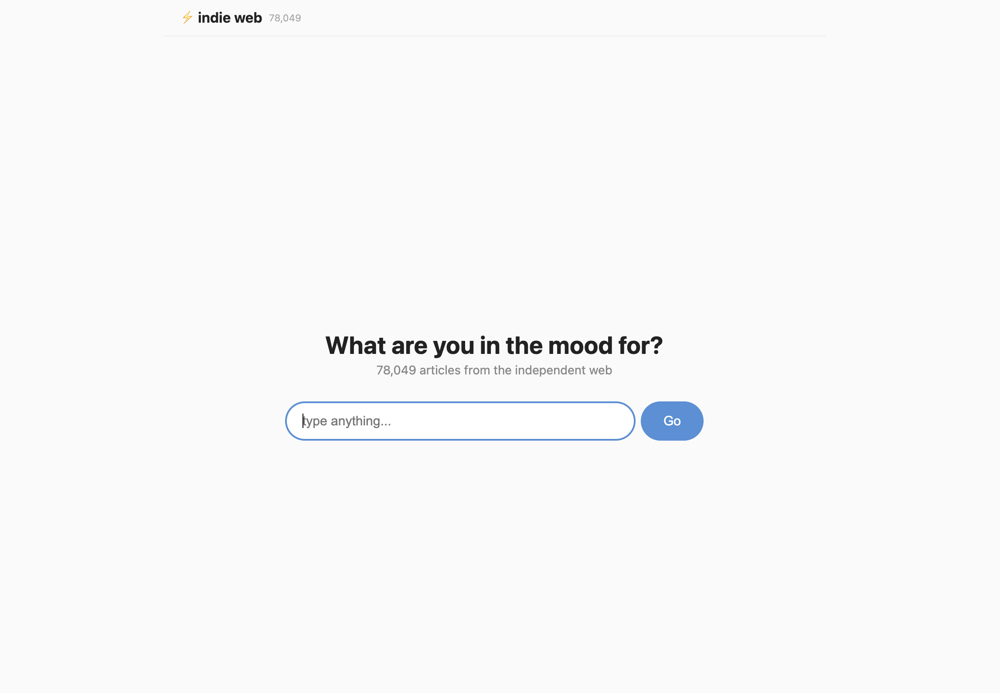

# Gist — Semantic search for the indie web

**[indie-web-explore.onrender.com](https://indie-web-explore.onrender.com/)**

Gist is a semantic search engine for the independent web. Tell it what you're in the mood for — "weird DIY tech projects," "solo travel in Southeast Asia," "burnout and career changes" — and it finds blog posts that match the meaning, not just keywords.

Built with Express, LanceDB (vector search), OpenAI embeddings, and DeepSeek (via OpenRouter) for conversational query refinement.

## How it works

```
Your query → AI chat agent (clarify or search) → OpenAI embedding → LanceDB vector search → results + follow-up ideas
```

1. Type what you're looking for — natural language, no keyword tricks
2. The AI agent asks 0–3 clarifying questions or searches directly
3. OpenAI `text-embedding-3-small` converts the query into a 512-dimension vector
4. LanceDB finds the most semantically similar articles from the indie web
5. Results appear with links, feed sources, and follow-up suggestions to keep exploring



## Quick start

```bash
cp .env.example .env
# Edit .env — set OPENAI_API_KEY and OPENROUTER_API_KEY

npm install
node backend/bootstrap.js
```

Frontend + backend at `http://localhost:3000`.

### Production (Render)

```bash
# Render build command
npm install

# Render start command
node backend/bootstrap.js
```

Set env vars (`OPENAI_API_KEY`, `OPENROUTER_API_KEY`, `DB_URL`) in the Render dashboard — no `.env` file needed. The backend serves both the API and the built frontend on a single port.

## Requirements

- Node.js 18+
- npm 9+

## Tech stack

- **Backend**: Express 5, LanceDB (vector DB), OpenAI API (embeddings), OpenRouter API (DeepSeek)
- **Frontend**: Vanilla HTML + CSS + JS (no framework)
- **DB**: LanceDB — 512-dim vector embeddings of indie blog articles
- **Bootstrap**: adm-zip to extract pre-built database, dotenv for config

## Project structure

```
├── backend/
│   ├── bootstrap.js    Downloads & extracts the pre-built LanceDB
│   └── src/
│       └── index.js    Express server — /api/chat, /api/search, /api/stats
├── frontend/
│   └── index.html      Single-page app
├── data/               LanceDB database (gitignored)
├── .env                DB_URL, OPENAI_API_KEY, OPENROUTER_API_KEY
└── package.json
```

## License

MIT
