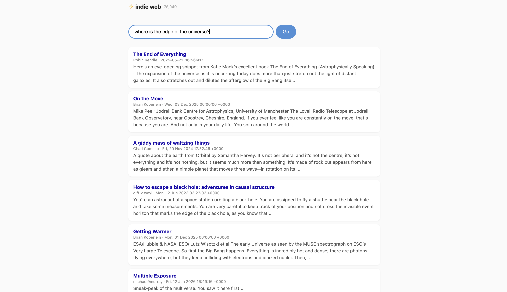

# Indie Web Explorer — Semantic search for the indie web

**[indie-web-explore.onrender.com](https://indie-web-explore.onrender.com/)**

Semantic search engine for the independent web. Tell it what you're in the mood for — "weird DIY tech projects," "solo travel in Southeast Asia," "burnout and career changes" — and it finds blog posts that match the meaning, not just keywords.

Built with Express, LanceDB (vector search), OpenAI embeddings, and OpenRouter (DeepSeek) for query rewriting and follow-up suggestions. The vector index is built from [indieblog.page](https://indieblog.page/all) — you'll need to create it yourself (see setup).

## How it works

```
Your query → AI rewrites into diverse search queries → OpenAI embeddings → LanceDB vector search → results + follow-up ideas
```

1. Type what you're looking for — natural language, no keyword tricks
2. DeepSeek (via OpenRouter) rewrites your query into a few diverse search angles
3. OpenAI `text-embedding-3-small` embeds each search phrase into a 512-dim vector
4. LanceDB finds the most semantically similar articles from the indie web
5. Results appear with links, feed sources, and follow-up suggestions to keep exploring

 

## Setup

### 1. Scrape + embed

The search data comes from [indieblog.page](https://indieblog.page/all). Scrape the feeds into a CSV with this exact schema:

```
feedUrl,feedTitle,title,link,pubDate,text
```

Then run the embed script to generate OpenAI embeddings and build the LanceDB index:

```bash
# Place your articles.csv in the project root
node scripts/embed.mjs
```
### 2. Configure and run

```bash
cp .env.example .env
# Edit .env — set OPENAI_API_KEY and OPENROUTER_API_KEY

npm install
node backend/src/index.js
```

Frontend + backend at `http://localhost:3000`.

### Production (Render)

```bash
# Render build command
npm install

# Render start command
node backend/src/index.js
```

Set env vars (`OPENAI_API_KEY`, `OPENROUTER_API_KEY`) in the Render dashboard — no `.env` file needed. The backend serves both the API and the built frontend on a single port.

## Requirements

- Node.js 18+
- npm 9+

## Tech stack

- **Backend**: Express 5, LanceDB (vector DB), OpenAI API (embeddings), OpenRouter API (DeepSeek)
- **Frontend**: Vanilla HTML + CSS + JS (no framework)
- **Embedding pipeline**: csv-parse, tiktoken, scripts/embed.mjs
- **DB**: LanceDB — 512-dim vector embeddings of indie blog articles


## Project structure

```
├── backend/
│   └── src/
│       └── index.js    Express server — /api/chat, /api/search, /api/stats
├── frontend/
│   └── index.html      Single-page app
├── scripts/
│   └── embed.mjs       Reads articles.csv, generates embeddings, builds LanceDB
├── data/               LanceDB database (gitignored)
├── .env                DB_URL, OPENAI_API_KEY, OPENROUTER_API_KEY
└── package.json
```

## License

MIT
